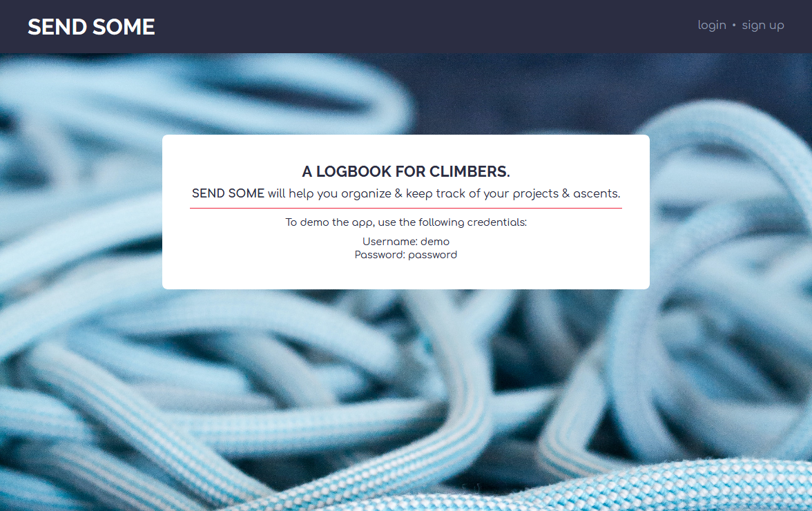
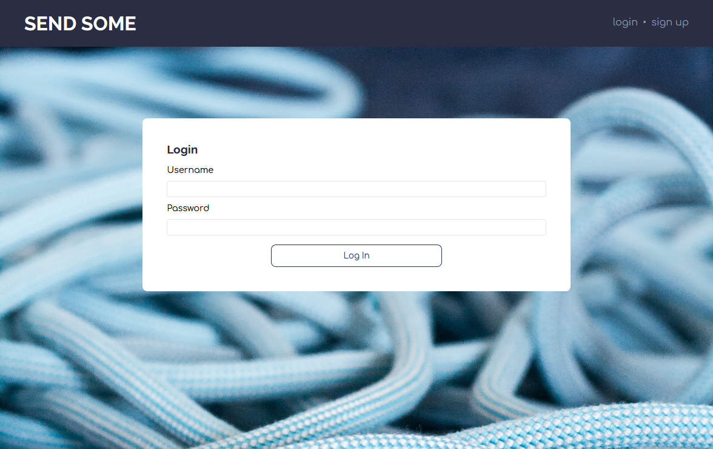
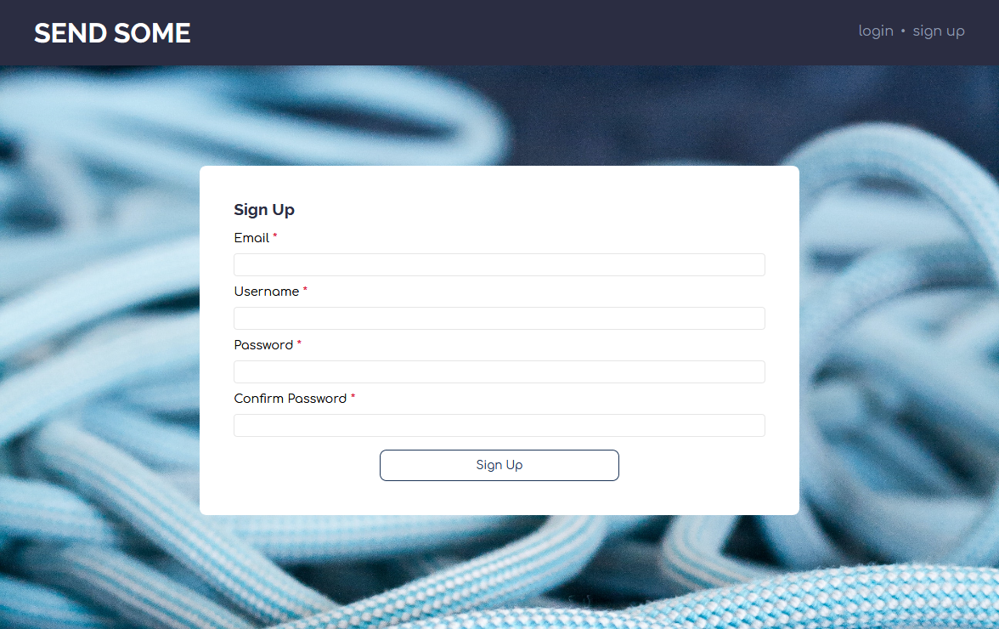
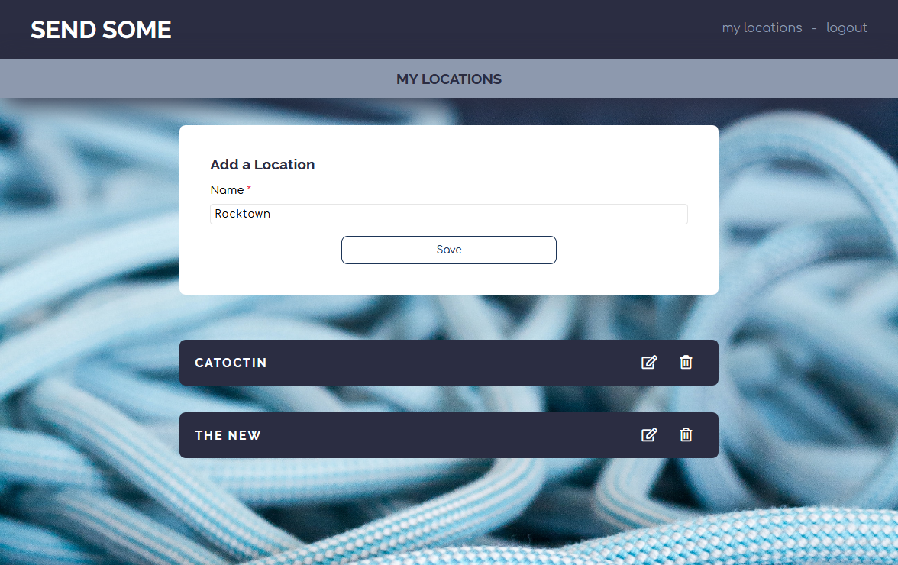
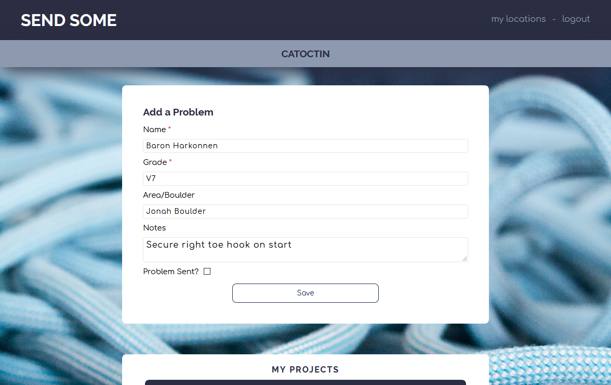
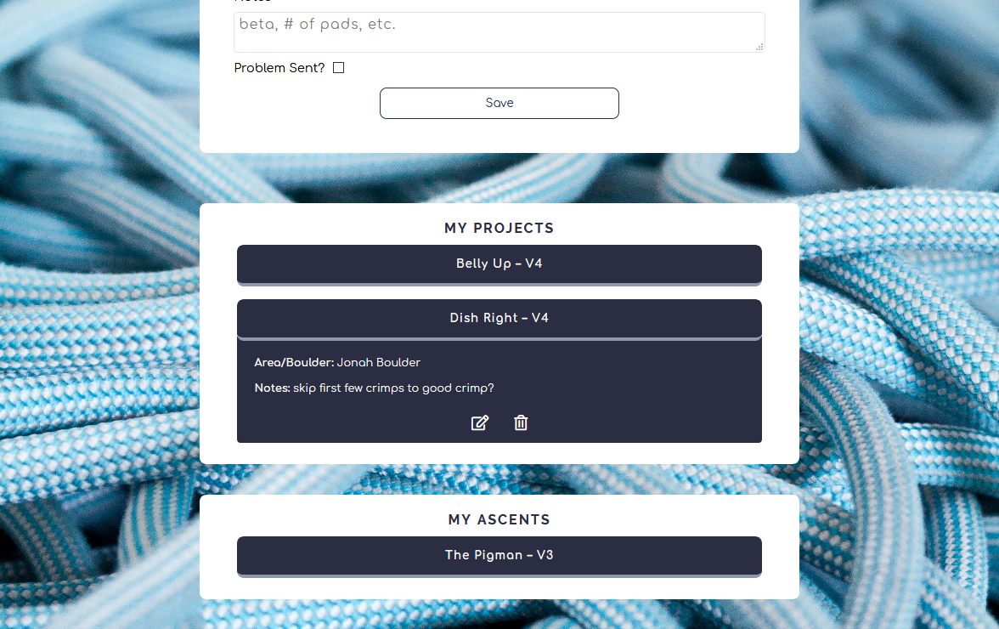
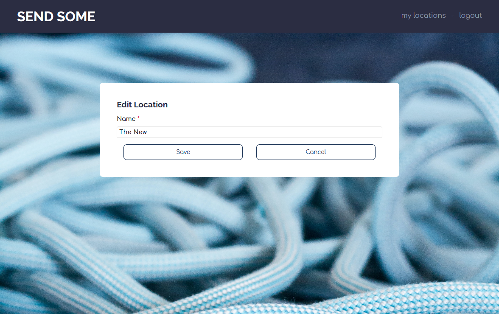
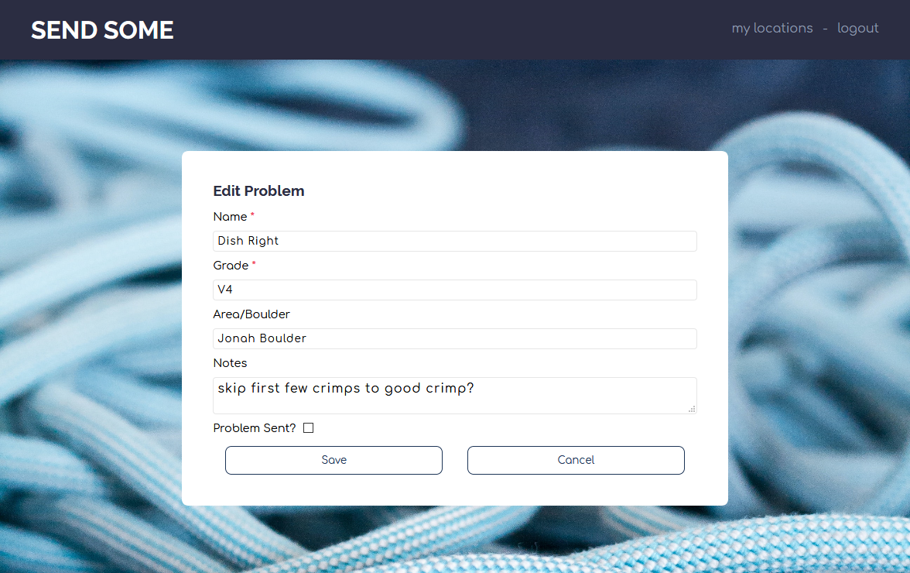

# SEND SOME

[LIVE APP](https://send-some-client.vercel.app/)

## Summary

This app was created to help climbers log problems that they are currently working on & problems that they have completed, organzing them by location.

## A Walk Through the App

**Landing Page**



**Login & Sign Up Pages**





**Locations Page**



**Problems Page** 



**Problems List**



**Edit Location & Edit Problem Pages**





## API Documentation

```bash
https://nameless-ocean-69531.herokuapp.com/api
```

**Endpoints**

POST a login request.

```bash
/auth/login
```

POST a sign up request.

```bash
/auth/signup
```

GET all locations for a user.

```bash
/locations
```

GET a location by id.

```bash
/locations/:location_id
```

GET all problems in a location for a user.

```bash
/locations/:location_id/problems
```

GET a problem by id.

```bash
/locations/:location_id/problems/:problem_id
```

POST a location.

```bash
/locations
```

POST a problem in a location.

```bash
/locations/:location_id/problems
```

PATCH a location.

```bash
/locations/:location_id
```

PATCH a problem in a location.

```bash
/locations/:location_id/problems/:problem_id
```

DELETE a location.

```bash
/locations/:location_id
```

DELETE a problem in a location,

```bash
/locations/:location_id/problems/:problem_id
```

## Technologies

* React
* CSS
* Node
* Express
* PostgreSQL